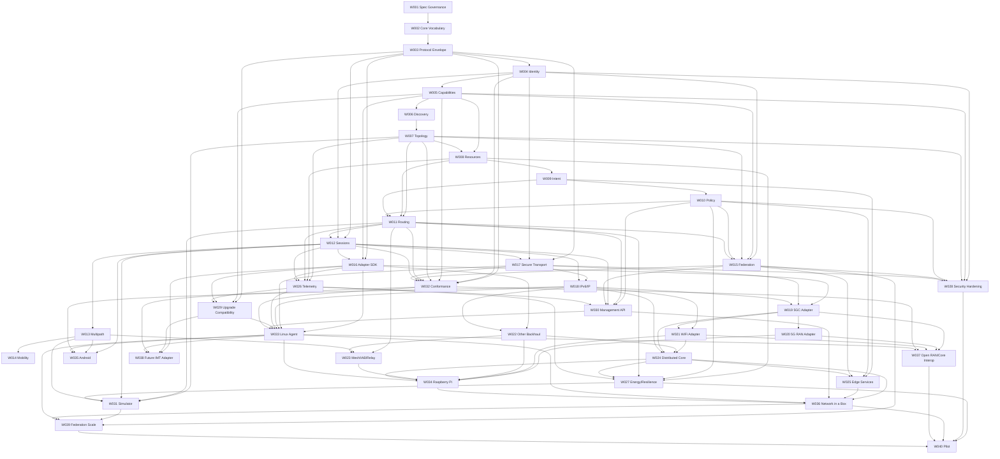

# ADCOS Work Item Dependency Graph

## Status

**FROZEN**

This graph defines the approved implementation order. Z.ai must not implement a downstream Work Item before all hard dependencies are complete and architect-accepted.

---

## 1. Graph Rules

1. A completed PR is not a satisfied dependency until the Architect accepts the Work Item.
2. A failed/reopened Work Item invalidates dependent readiness until resolved.
3. Optional parallelism is allowed only where the graph explicitly shows no hard dependency.
4. Work Items must not introduce hidden dependencies by importing future modules early.
5. Architecture changes require graph recalculation before implementation continues.
6. A Work Item may depend on a capability that is only available behind an adapter; it must not copy that adapter's internal implementation into the core.

---

## 2. Dependency DAG



---

## 3. Execution Phases

### Phase 0 — Specification
`W001 → W002 → W003`

No networking implementation should begin before these are accepted.

### Phase 1 — Identity and fabric state
`W004 → W005 → W006 → W007 → W008 → W009 → W010`

This establishes the vocabulary, evidence model, discovery, resource model, intent, and policy system.

### Phase 2 — Connectivity semantics
`W011 → W012 → W013 → W014 → W015`

This establishes routing, sessions, multipath, mobility, and federation before concrete 5G implementation.

### Phase 3 — Adapter/transport foundation
`W016 → W017 → W018`

This is the seam that makes 5G, Wi-Fi, and future technologies replaceable.

### Phase 4 — Real access and distributed network
`W019 → W020`

`W021` and `W022` may proceed in parallel with `W020` after their dependencies are satisfied.

`W023 → W024 → W025` follows once routing/multipath/backhaul contracts exist.

### Phase 5 — Hardening/operations
`W026`, `W027`, `W028`, `W029`, and `W030` proceed as dependencies allow. These are cross-cutting but must remain inside the frozen authority boundaries.

### Phase 6 — Executable reference platform
`W031 → W032 → W033`

These establish simulation, conformance, and the Linux reference Agent.

### Phase 7 — Hardware/device profiles
`W034`, `W035`, `W036`, `W037` follow from the reference Agent and adapter stack.

### Phase 8 — Future generation and scale
`W038 → W039 → W040`

The architecture is not considered future-proof until `W038` proves a hypothetical 6G/future-access implementation can be added without changing the core protocol.

---

## 4. Critical Path

The current architectural critical path is:

```text
W001
 → W002
 → W003
 → W004
 → W005
 → W006
 → W007
 → W011
 → W012
 → W016
 → W017
 → W018
 → W019
 → W020
 → W032
 → W033
 → W037
 → W038
 → W039
 → W040
```

This is intentionally not the only path. Wi-Fi, fixed backhaul, simulator, telemetry, and resilience can evolve in parallel when their graph dependencies are met.

---

## 5. Dependency Semantics

### Hard dependency
The downstream Work Item must not be accepted/merged before the upstream item is accepted.

### Soft/parallel dependency
The downstream item may begin implementation only after the upstream contract exists, even if the upstream implementation is still evolving, provided the relevant interface is frozen and the Architect explicitly permits parallel development.

### Adapter dependency
A Work Item may depend on an external technology implementation but must interact only through the adapter contract.

---

## 6. Work-Item Sequencing Rule for Z.ai

Z.ai receives exactly one active Work Item at a time through the implementation prompt generated by the Architect.

The prompt must include:

```text
Work Item ID
Architecture version
Relevant architecture sections
Relevant architecture-lock clauses
Dependencies
Acceptance criteria
Expected files/modules
Out of scope
Verification requirements
Required tests
Forbidden architectural shortcuts
```

Z.ai must not infer missing architecture from the codebase. The frozen documents are authoritative.

---

## 7. Review Gate

For each Work Item the Architect performs:

1. inspect the complete diff;
2. inspect all changed architecture-sensitive interfaces;
3. compare implementation to the Work Item;
4. compare implementation to the architecture lock;
5. run/inspect required tests and CI;
6. inspect for hidden dependency or authority duplication;
7. inspect for access/vendor leakage into core;
8. require corrections where any mismatch exists;
9. approve only when the Definition of Done is satisfied.

A passing test suite cannot override an architecture violation.

---

## 8. Completion Criterion

ADCOS is architecturally complete only when all 40 Work Items are Architect-accepted and the final conformance/interop/pilot evidence demonstrates:

```text
5G today
   +
Wi-Fi/fixed/satellite/mesh
   +
community-scale deployment
   +
inter-domain federation
   +
resilience
   +
real device participation
   +
future-IMT adapter proof
   ↓
ONE ADCOS FABRIC
```